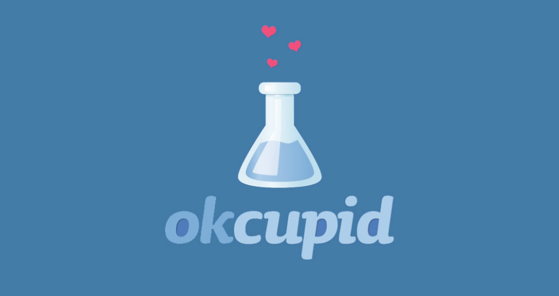

## McNulty: OK Cupid Attribute Predictor
This Flask app uses the dataset of OK Cupid questionaire responses to predict unanswered/invisible attributes of a user based on available information on the profile.

([Link](https://bobtian.wordpress.com/fun-with-the-ok-cupid-dataset/) to blog for more information on the project)

